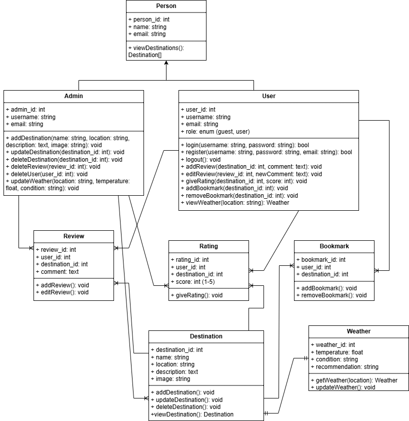

# **Searena App** 
## **🌊 Searena: Jelajahi Nusantara, Arungi Surga Wisata**

Searena hadir sebagai teman perjalanan Anda. Searena adalah aplikasi desktop berbasis C# .NET WinForms dengan integrasi API Weather yang membantu pengguna mencari, mengeksplorasi, dan membandingkan destinasi wisata maritim di Indonesia. Aplikasi ini mendukung fitur rekomendasi cuaca, pencarian, filter, rating & review, bookmark, serta halaman admin untuk mengelola destinasi. 

Searena dikembangkan sebagai bagian dari Junior Project DTETI UGM dengan penerapan Object-Oriented Programming (OOP), arsitektur berlapis, dan integrasi database PostgreSQL (Supabase). 


## **👥 Kelompok Searena**  
1. Freddy Tanusina - 20/456841/TK/50665
2. Nevrita Natasya Putriana - 23/514635/TK/56500
3. Joecelyn Aurora Majesty - 23/514716/TK/56510  


## **💡 Fitur Aplikasi**  
- Integrasi Cuaca Real-Time
  - Menampilkan suhu, kelembapan, dan kecepatan angin
  - Deskripsi kondisi cuaca terkini
  - Status rekomendasi cuaca (Sangat Baik / Cukup Baik / Kurang Baik)
  - Update data cuaca secara berkala
- Sistem Rekomendasi Destinasi
  - Filter berdasarkan pulau (Jawa, Bali, Sumatera, dll)
  - Filter berdasarkan aktivitas (Snorkeling, Diving, Sunset, Camping)
  - Sorting berdasarkan rating, popularitas, atau rekomendasi
  - Pencarian dengan auto-suggestion
- Manajemen User
  - Register dan Login: Sistem autentikasi user
  - Profile Management: Kelola profil dan informasi personal
  - Bookmark: Simpan destinasi favorit
  - Rating dan Review: Beri penilaian dan ulasan destinasi
- User Interface Modern
  - Dashboard interaktif dengan Guna UI 2.0
  - Responsive card layout untuk destinasi
  - Smooth scrolling dan navigation
  - Visual feedback untuk setiap aksi
- Admin Dashboard
  - Tambah, edit, dan hapus destinasi
  - Kelola review dan berikan response
  - Update informasi harga dan waktu terbaik berkunjung
  - Monitor rating dan total review
- Pencarian & Filter Lanjutan
  - Search box dengan auto-suggestion
  - Multi-filter (pulau, aktivitas, rating)
  - Clear filter dengan satu klik
  - Hasil pencarian real-time


## **🛠 Tech Stack**
- Frontend
  - C# .NET WinForms
  - Guna.UI2.WinForms
  - Figma untuk mengedit dan eksplorasi UI
- Backend
  - C# OOP
  - API Weather
  - DotNetEnv untuk load file .env
- Database
  - PostgreSQL dan dihosting di Supabase
  - Akses menggunakan Npgsql
- Tools
  - Visual Studio 2022
  - Git dan GitHub
  - Supabase


## **📂 Struktur Folder**
```
Searena/
│
├── docs/                    
│
├── searena-frontend/
│   └── SEARENA2025/          # Folder utama aplikasi WinForms
│       ├── Properties/
│       ├── App.config
│       ├── app.manifest
│       ├── DashboardItem.cs
│       ├── DashboardUtama.cs
│       ├── DatabaseHelper.cs
│       ├── DestinasiCard.cs
│       ├── DetailDestinasi.cs
│       ├── Form1.cs
│       ├── PageAdmin.cs
│       ├── Profile Bookmark.cs
│       ├── Profile Rating.cs
│       ├── RatingSource.cs
│       ├── WeatherService.cs
│       ├── UserSession.cs
│       ├── SEARENA2025.csproj
│       └── Program.cs
│
├── src/                     
│
├── .gitignore
├── SEARENA2025.sln
└── README.md
```


## **⚒️ Instalasi**
1. Clone Repository
      ```bash
      git clone https://github.com/USERNAME/searena.git
      cd searena/searena-frontend/SEARENA2025
      ```
2. Buka Solution di Visual Studio 2022
    - Buka SEARENA2025.sln
    - Visual Studio 2022 akan otomatis Restore NuGet Packages
    Jika perlu manual, maka ketik ini di terminal:
   ```powershell
   Update-Package -reinstall
   ```
3. Setup Database Melalui Supabase PostgreSQL
    - Masuk ke https://supabase.com
    - Buat project dan buka tab SQL Editor
    
## **🔐 Environment Variables (.env)**
Buat file `.env` di folder `SEARENA2025/`
```
# SUPABASE DATABASE
DB_CONNECTION=Host=aws-1-ap-southeast-1.pooler.supabase.com;Port=5432;Database=postgres;Username=postgres.xxxxx;Password=your_supabase_password

# WEATHER API
WEATHER_API_KEY=your_weatherapi_key
WEATHER_BASE_URL=https://api.weatherapi.com/v1/current.json
```
Pastikan sudah menginstall DotNetEnv agar file `.env` bisa terbaca
```
Install-Package DotNetEnv
```


## **🌤 Mendapatkan Weather API Key**
- Buka https://www.weatherapi.com
- Daftar akun (gratis)
- Copy API Key dari dashboard
- Letakkan di .env pada WEATHER_API_KEY
  

## **▶️ Menjalankan Aplikasi**
- Pastikan .env sudah terisi
- Build solution: Build → Build Solution (Ctrl+Shift+B)
- Klik Start Debugging untuk memulai aplikasi
  

## **✨ Class Diagram dari Searena**




Dikembangkan oleh Freddy, Nevrita, dan Joecelyn | Junior Project DTETI 2025 |  Searena: 'Edisi Industri Maritim'


 
